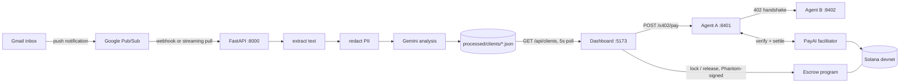

# Exia — a personal financial agent that pays per use

Statements arrive by email. Personal data is stripped out before any AI sees them.
What comes back is structured analysis — what you spent, what changed, what needs
attention.

When the agent needs a specialist, it hires one: it calls a financial-analysis
agent over **x402** and pays per report — 0.1 USDC settled on Solana in about five
seconds, no account and no subscription. The fee is escrowed on-chain first and
only released once the report is delivered.

---

## Contents

1. [Architecture](#1-architecture)
2. [The ingestion pipeline](#2-the-ingestion-pipeline)
3. [PII redaction](#3-pii-redaction)
4. [AI analysis](#4-ai-analysis)
5. [Payment rails](#5-payment-rails)
6. [Frontend](#6-frontend)
7. [Process & port map](#7-process--port-map)
8. [Security posture](#8-security-posture)
9. [Running it](#9-running-it)
10. [Real vs demo data](#10-real-vs-demo-data)
11. [Known limitations](#11-known-limitations)

---

## 1. Architecture



Three independent systems, deliberately separated:

| System | Language | Holds |
|---|---|---|
| Ingestion + analysis | Python / FastAPI | Gmail OAuth, GCP service account, Gemini key |
| Payment agents | Node / Express | one Solana signing key (Agent A only) |
| Dashboard | React / Vite | nothing — the browser wallet signs |

The wallet key lives in its own process on purpose. The FastAPI process already
carries Gmail OAuth, a GCP service-account key and a Gemini key; adding a spending
key to that blast radius would mean one compromise costs you both your mail and
your funds.

---

## 2. The ingestion pipeline

### Trigger — two modes

**Streaming pull (default, no public endpoint).** The app opens an outbound
connection to Pub/Sub and fetches messages itself. Nothing inbound, so no tunnel
and nothing to authenticate. Enabled by setting `PUBSUB_SUBSCRIPTION_ID`.

**Push webhook.** Google POSTs to `/api/webhooks/gmail`. Requires a public HTTPS
URL and `PUBSUB_VERIFICATION_TOKEN` — without the token the endpoint accepts
requests from anyone who finds the URL, and the app logs an error at startup
saying so.

### Per-attachment stages

`api/gmail.py::_process_attachment_pipeline`

```
1  history diff       Gmail history API → new message IDs since last state
2  fetch attachment   base64url decode, size-capped at MAX_ATTACHMENT_SIZE_MB (25)
3  extract text       pypdf / openpyxl / xlrd / csv → plain text
4  redact PII         regex pass, returns (clean_text, counts)
5  analyse            Gemini, JSON-schema constrained
6  store              one JSON per sender domain, atomic write
```

Stage 5 returns `None` on any failure — no key, timeout, API error, malformed
JSON, missing keys. Nothing is invented to fill the gap; the document is simply
recorded as unanalysed.

### Storage

`processed/clients/<domain>.json`, written atomically via a temp file + rename so
a crash mid-write cannot corrupt an existing record. No database.

```jsonc
{
  "domain": "n2nconnect.com",
  "contact_email": "…",
  "first_seen": "2026-08-22T07:46:39Z",
  "documents": [
    {
      "message_id": "1a0286d56b8b7025",   // dedupe key
      "filename": "statement.pdf",
      "stored_path": "downloads/statement_6b8b7025.pdf",
      "extraction_ok": true,
      "redaction_counts": { "CREDIT_CARD": 1, "PHONE": 1, "BANK_ACCOUNT": 5 },
      "analysis": { /* Gemini output, see §4 */ }
    }
  ]
}
```

---

## 3. PII redaction

`services/pii_service.py` — runs **before** the text reaches Gemini.

Regex-only, not NER. That is a deliberate trade: no extra ML dependency, no model
load time, and predictable latency on a 60k-character document. The signature
`redact_pii(text) -> (clean_text, counts)` is stable, so a Presidio-based detector
can be swapped in later without touching callers.

Five entity types, applied in a fixed order so the greedier patterns do not eat
the more specific ones:

```
SSN  →  CREDIT_CARD  →  PHONE  →  EMAIL  →  BANK_ACCOUNT
```

`BANK_ACCOUNT` (`\d{8,17}`) is last because it would otherwise swallow card and
phone numbers. Counts are stored per document, so you can always answer "what was
removed from this file" after the fact.

> The patterns are bounded — no nested quantifiers — because the input is an
> untrusted email attachment and a catastrophic-backtracking regex here is a
> denial-of-service vector.

---

## 4. AI analysis

`services/analysis_service.py`

| | |
|---|---|
| Model | `GEMINI_MODEL` (default `gemini-3.6-flash`) |
| Client | `google-genai`, async (`client.aio.models.generate_content`) |
| Input cap | 60,000 chars — truncated with a warning, not silently |
| Timeout | 60 s |
| Output | JSON-schema constrained, validated against `REQUIRED_KEYS` |

Response shape:

```jsonc
{
  "document_type": "cash_flow",        // classified into 6 types, or "other"
  "readable": true,
  "company_name": "…",
  "period": "FY2025",
  "summary": "…",
  "key_figures": [ { "label": "…", "value": "…", "period": "…" } ],
  "risk_flags": [ "…" ],
  "sentiment": "positive",
  "confidence": "high"
}
```

`client_view_service.py` maps stored records into the dashboard's shape. Its rule:
**a report section is only "ready" if a document that unlocks it was actually
analysed.** A missing document produces a locked section, never plausible-looking
filler text.

---

## 5. Payment rails

Two mechanisms, different parties, different assets.

### x402 — agent-to-agent, per report

Agent A (buyer) pays Agent B (seller) 0.1 devnet USDC for the premium data behind
a report.

```
A → GET /premium/risk-report
B → 402 + PAYMENT-REQUIRED header + requirements body
A → beforePayment policy check → sign SPL transfer
A → GET again with PAYMENT-SIGNATURE
B → verifyPayment → settlePayment (facilitator) → 200 + content
```

| | |
|---|---|
| Library | `x402-solana@3.0.0` over `@x402/core@2.21.0` |
| Network | `solana-devnet` → CAIP-2 `solana:EtWTRABZaYq6iMfeYKouRu166VU2xqa1` |
| Asset | USDC `4zMMC9srt5Ri5X14GAgXhaHii3GnPAEERYPJgZJDncDU`, 6 dp |
| Price | `100000` atomic = 0.1 USDC |
| Facilitator | `https://facilitator.payai.network` (free tier, no API key) |
| Round trip | ~5–6 s |

The facilitator co-signs as fee payer, so the payment is **gasless** — Agent A
needs USDC but no SOL.

**Controls.** A `beforePayment` hook refuses to sign unless `payTo` matches the
expected treasury — this runs *before* the transaction is built, so a redirected
quote never gets a signature. A hard bigint ceiling (`MAX_PAYMENT_ATOMIC`) is
enforced before that. Server-side, Agent B verifies amount, mint, network and
recipient against requirements *it* generated, and tracks settled signatures to
reject replays.

x402 on Solana is **SPL-only** — there is no native-SOL scheme. That is why the
agent payment is USDC while the escrow below is SOL.

### Escrow — user to provider, per report

Anchor program `4XLxUFx1rApJJkjtfjaQn99cwe3WSkDkCmUsqq2L911J` on devnet.
Two instructions:

- **`deposit(recipient)`** — inits PDA `["escrow", maker]`, transfers a fixed
  100,000,000 lamports (0.1 SOL) in, records `{maker, recipient, amount, bump}`.
- **`release()`** — permissionless: any signer may crank it. Pays the **recorded**
  recipient, never the caller, then closes to the maker for the rent refund.

Permissionless release is safe only because the destination is fixed at deposit
and re-checked via `has_one`. A stranger cranking it can complete the escrow but
never redirect it. Closing the account is also what makes release non-replayable —
a second call finds nothing to deserialize.

The PDA is program-owned, so lamports move by checked `try_borrow_mut_lamports`
arithmetic; a System-transfer CPI cannot sign for it. `overflow-checks = true` in
the release profile, because a silent wrap here mints or burns value.

Full detail, the deploy runbook and two upstream `x402-solana` bugs worked around
in Agent B: **[`solana/README.md`](solana/README.md)**.

---

## 6. Frontend

React 19 + Vite 8, no component framework, no state library. Design tokens in
`src/index.css`.

```
src/
  data/personalData.js      baseline demo figures + live-data merge + parsers
  hooks/useProcessedClients polls /api/clients every 5 s
  hooks/usePhantomWallet    provider detection, connect, signTransaction
  solana/escrowClient.js    builds instructions by hand from the IDL
  components/
    OverviewPage            stat tiles + reminders + spend + analysis
    RemindersWidget         top-3 actions, severity by colour + icon + label
    SpendingBreakdown       single-hue bars, table toggle
    AnalysisPanel           tabbed: Statements (live) | Tax | Investments | …
    ReportSettlement        3-step lock → pay → release
```

**Polling, not WebSockets.** Stateless, survives a backend restart or a dropped
tunnel with no reconnect logic, and a few seconds of latency is irrelevant against
a pipeline whose upstream already takes longer than that.

**The escrow client is hand-rolled.** `@coral-xyz/anchor` tops out at 0.32.1 while
the program is built with Anchor 1.1.2 — there is no 1.x TS client on npm. Rather
than bet on that mismatch, instructions are built from the IDL's discriminators
and account order, and a Rust test (`test_pda_parity.rs`) pins the PDA and
discriminators against the JS so drift is caught at build time, not on-chain.

**Release is gated on payment in the UI.** The on-chain program is permissionless
and cannot see the report — it would release whenever asked. The gate is a
workflow guard, not a security control. Phrase it that way.

---

## 7. Process & port map

| Port | Process | Holds a key? | Start |
|---|---|---|---|
| 8000 | FastAPI backend | Gmail OAuth, GCP SA, Gemini | `uvicorn app.main:app --reload --port 8000` |
| 8402 | Agent B — x402 seller | no | `cd solana && npm run agent-b` |
| 8401 | Agent A — x402 buyer | **yes**, Solana | `cd solana && npm run agent-a` |
| 5173 | Dashboard | no | `cd dashboard && npm run dev` |

Vite proxies `/api` → `:8000` and `/x402` → `:8401`, so the browser sees
same-origin requests and no ports are baked into the bundle.

---

## 8. Security posture

**Secrets.** `.gitignore` covers `*-sa.json`, `.env`, `solana/.keys/`, and
`**/*-keypair.json`. Verified with `git check-ignore` rather than assumed. The two
Solana keypairs were generated locally and are throwaways — nothing was exported
from Phantom, which matters because devnet and mainnet share one address space, so
a "devnet wallet" in Phantom is the same keypair on mainnet.

**Redaction before inference.** PII never reaches Gemini. Counts are retained per
document for audit.

**Least privilege.** Gmail scope is `gmail.readonly`. Agent B holds no key at all —
it only names a treasury address to be paid into.

**Logging.** Only public on-chain facts (signatures, payer addresses) are logged.
No document text, no key material.

**Audit trail.** Both escrow instructions emit Anchor events, queryable from
transaction logs.

**Known dependency risk.** `npm audit` reports 9 issues in the Solana JS tree, all
`fix: unavailable` — `bigint-buffer` (HIGH, buffer overflow in `toBigIntLE`) via
`@solana/spl-token`, and `uuid` (MODERATE) via `jayson`. No upgrade path exists:
`x402-solana` peer-depends on `@solana/web3.js` v1, and v1 pulls both. Clears only
when the library moves to `@solana/kit`. Acceptable on devnet with non-hostile
inputs; **re-evaluate before production.**

---

## 9. Running it

Cold start, health checks, the demo script and a failure table:
**[`DEMO.md`](DEMO.md)**.

Escrow build, test, deploy and recovery: **[`solana/README.md`](solana/README.md)**.

```bash
cd solana/escrow && cargo test      # 8 tests, litesvm, no validator, free
cd solana && npm run escrow:smoke   # full deposit → release on devnet
```

---

## 10. Real vs demo data

Worth being precise about, because the distinction is easy to blur.

**Real.** The escrow program and both its transactions. The x402 handshake and
USDC transfer. Everything on the dashboard's **Statements** tab — document counts,
summaries, key figures, risk flags, and the reminders derived from them — all
produced by Gemini from documents that actually arrived by email. The analysis
service has no fallback path: if the model call fails it returns `None`, so an
analysis existing at all means a real call succeeded.

**Demo.** Spending categories and figures, the stat tiles, five of the six standing
reminders, and the Tax / Investments / Insurance / Loans tabs. All in
`dashboard/src/data/personalData.js`.

The **Statements** tab carries a green dot in the tab strip to mark the live one.

Two display-layer transforms on live data, both cosmetic:

- **Label rename.** The backend classifies attachments as corporate statements
  because that is what its prompt asks for; the dashboard renames them for a
  personal framing (`Cash Flow Statement` → `Bank statement`). Making it genuinely
  personal means changing the backend taxonomy and the extraction prompt.
- **`FORCE_FRESH_LABEL`.** Pins the freshness label to "just now" for demos. The
  document count and content are untouched, so a newly processed email still
  visibly changes the panel. Set `false` for the true age.

---

## 11. Known limitations

- **Devnet only.** Unaudited, no mainnet path.
- **No cancel or timeout on the escrow.** Two instructions as specified, so once
  deposited the funds sit until someone calls `release`. A deadline plus `cancel`
  is the standard safety valve and would be a third instruction.
- **The escrow cannot see the report.** Gating release on delivery would need a
  hash commitment, an arbiter signature, or buyer confirmation — the chain has no
  view of off-chain work.
- **Replay guard is in-memory.** Two Agent B instances would each honour the same
  replayed header. Needs a shared store to be real.
- **Facilitator is a third-party single point of failure** for settlement. Fine
  for a demo; production needs an API key and a fallback.
- **PII redaction is regex-based.** It will miss names, addresses and
  unconventional formats that an NER model would catch.
- **No auth on the dashboard.** Anyone who can reach the port sees the data.
